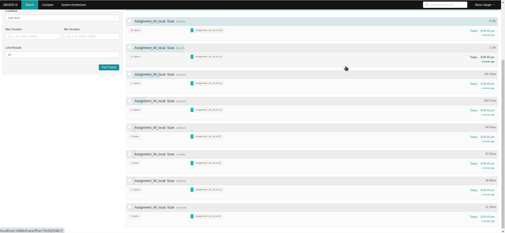
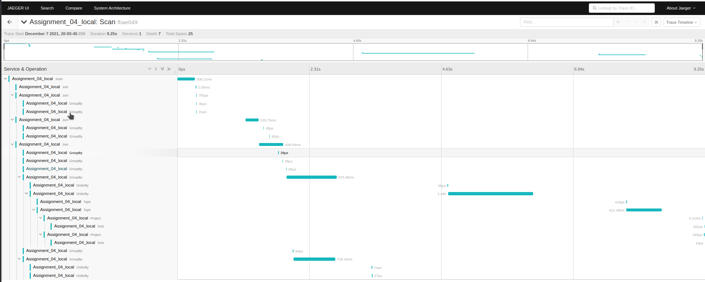

## Explanations of results on JaegerUI

The first screenshot depicts all 8 span trees starting from 8 different calls of 
scan.execute.remote() (4 belongs to "Friends" table and 4 "Ratings" table). 
Each span has a different execution time depicting the reads of different input files since 7 out of 8 span trees start and reach up to Join or Select operator 
and only after the execution of the last one (the most time-consuming), Join operator will proceed to GroupBy operator and the following operators as well till we reach the Sink operators. 

  
The second screenshot depicts the operators which took the most time of the execution. 
As we expected, the most time-consuming operator was OrderBy since it is the first one operator with parallelism one who receives data from GroupBy operators with a parallelism of two. 
The second most time-consuming operator was GroupBy, which has to GroubBy all the input tuples given from Join operator.
